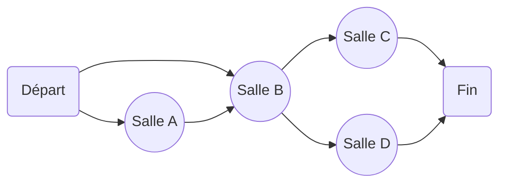
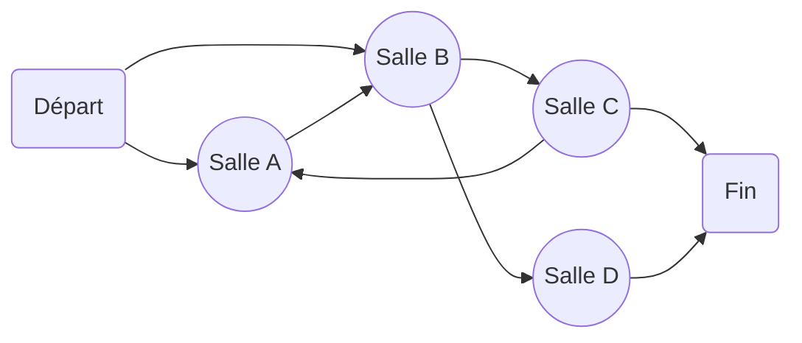

# Exercice structure et graphes.

## Préambule

Ce dépôt sert d'exercice permettant d'approfondir ses compétences en structuration de code et en gestion de graphe.

### Prérequis

Conaissances:

- Base de l'algorithmique et base de la programmation en langage C ou Python (3+)
- Gestion des structures en C ou en Python (3+)

Logiciel:

- Python 3+
- Un éditeur de texte/code de votre choix
- GCC pour compiler le langage C

# Donjons et Codons !

## Contexte

Un sorcier sort de votre écran et vous projette dans l'univers du numérique ! Pour vous en sortir, il faudra trouver le portail caché dans un donjon virtuel, il vous faudra vous apprendre à vous repérer et vous déplacer de salle en salle !

## Sujet

Le code est a effectuer dans le langage de votre choix, je conseille cependant le C ou le Python. Même si il est possible d'utiliser une programmation en orienté objet pour répondre au besoin, le but du sujet est de n'utiliser que la notion de structure.

### Structure du Donjon

En premier lieu, nous devons analyser et découvrir notre environnement, préparez les structures suivantes afin de modéliser le Donjon:

1. **Salle** \<Node>: Déclarez une structure **Node** qui sera identifier par un Nom et un ensemble de **Portail**.
2. **Portail** \<Link>: Un portail relie 2 **Salle**, une Source et une Destination.
3. **Donjon** \<Graph>: Un Donjon est identifiable par une **Salle** de Départ et de Fin
4. **Joueur** \<Player>: Un Joueur ne contient pour le moment qu'un Nom et sa **Salle** actuelle

Maintenant que nos modèles sont définis, nous allons pouvoir matérialiser notre Donjon !

### Construction du Donjon

Définissez les fonctions correspondantes pour chaque Structure

#### Salle \<Node>

- Création (nom en paramètre)
- Créer un **Portail** vers une autre **Salle** (la Salle de destination est en paramètre)

#### Portail \<Link>

- Création (**Salle** de **Départ** et de **Destination** en paramètre)

#### Donjon \<Graph>

- Création: Pour le moment, la création instanciera un Donjon codé en dur, un exemple de Donjon est disponible ci-dessous
- Afficher le Donjon, qui liste les Salles ainsi que leurs liens dans le terminal

#### Joueur \<Player>

- Créer un Joueur (le nom sera passé en paramètre)
- Assigner la salle courante (la nouvelle salle sera passé en paramètre)
- Afficher la salle courante (pour un Joueur passé en paramètre, affiche le nom de la salle où il se trouve et les destinations possibles parmis ses Portail)
- Passer un portail (le Joueur est passé en paramètre, ainsi que l'indice du Portail à utiliser, cad changer la salle actuelle du joueur par la destination du portail)

### Explorons le donjon !

Vous avez désormais toutes les fonctions à votre dispositions qui vont vous permettre de vous sortir de ce piège !

1. Créer le Joueur en demandant à l'utilisateur de saisir son nom
2. Créer le Donjon (pensez à assigner la salle du départ du donjon au Joueur...)
3. Lancez le jeu, chaque tour effectue les actions suivantes:
   1. Affiche la salle courante
   2. Demande le portail à emprunter
   3. Le joueur traverse le portail
4. On ne s'arrête que lorsque le Joueur a atteint la salle finale du Donjon

### Donjons récursif

Vous avez maintenant un Donjon qui peut être affiché et parcouru, cependant si nous modifions un peu le donjon actuel en liant la Salle C vers la Salle A on obtient le Donjon suivant:

Si vous tentez de l'afficher vous devriez voir un léger soucis avec la fonction d'affichage... A vous de le résoudre !
